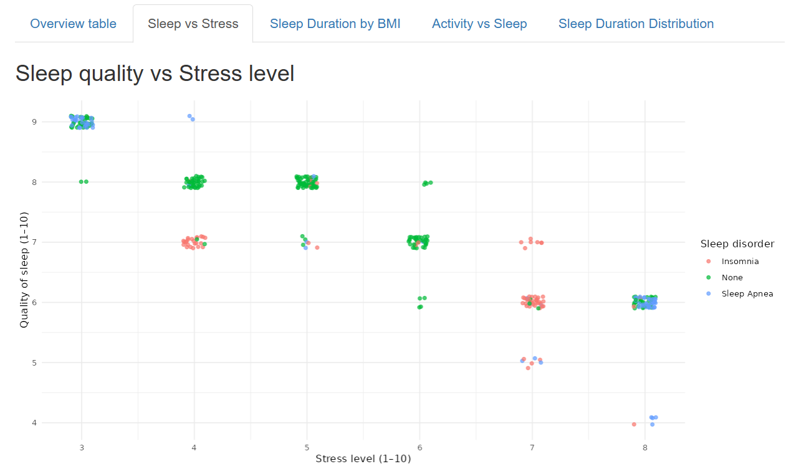
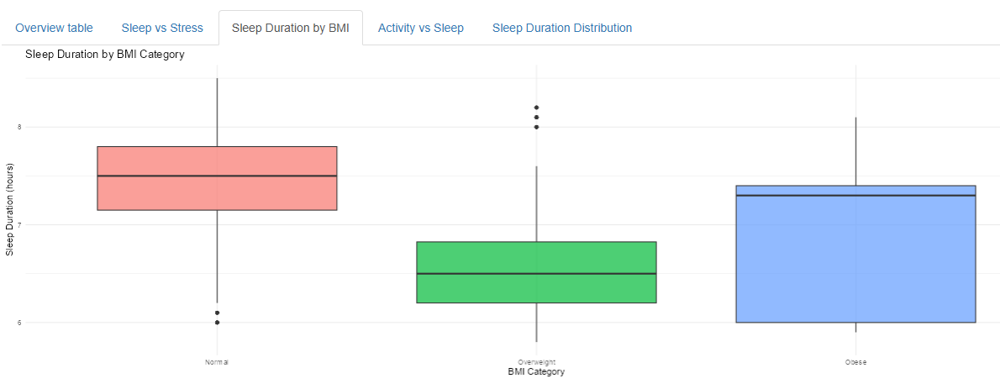
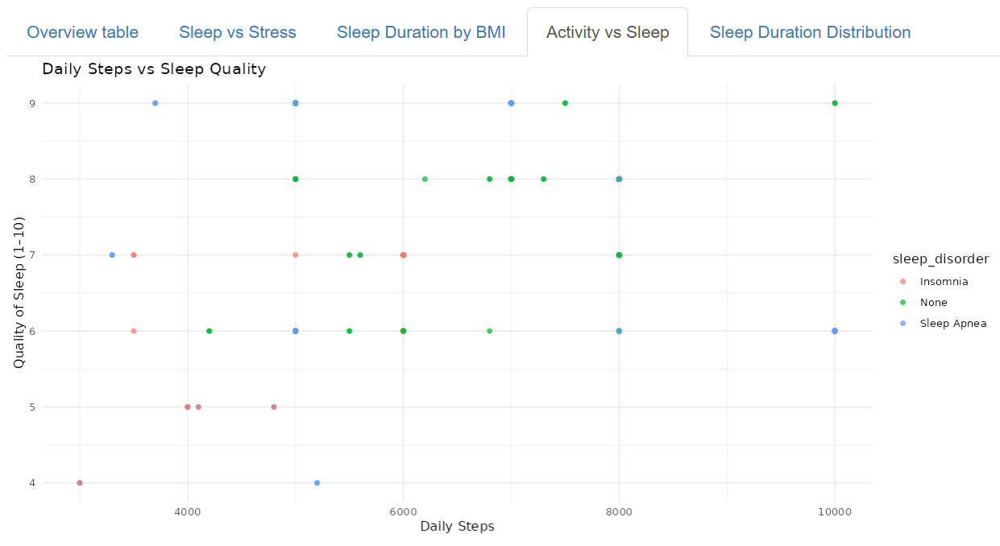
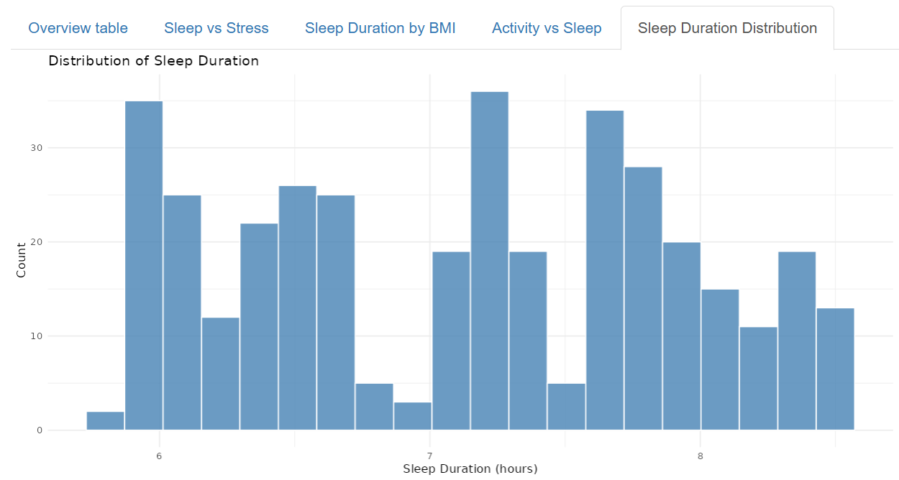

# Digital Health Insights: Sleep Health & Lifestyle Dashboard

## **An interactive visualization tool for exploring sleep patterns and lifestyle factors using R and Shiny.**

## Overview

Sleep health is influenced by a combination of behavioral, demographic, and physiological factors.\
Understanding how lifestyle elements, such as stress, BMI, physical activity, and daily steps — relate to sleep duration and sleep quality is crucial for preventive care and population-level health monitoring.

This project transforms the **Sleep Health and Lifestyle Dataset** (Kaggle) into an\
**interactive, user-friendly dashboard** built in **R** and **Shiny**.\
It enables users to dynamically filter and visualize sleep-related insights, turning raw data into actionable digital health intelligence.

------------------------------------------------------------------------

## Interactive Dashboard

Hosted on shinyapps.io:

------------------------------------------------------------------------

## Features

-   **Sleep Quality vs Stress Level** – visualize the relationship between stress and sleep quality\
-   **Sleep Duration by BMI Category** – compare how BMI affects sleep duration\
-   **Activity vs Sleep** – explore how daily steps relate to sleep quality\
-   **Sleep Duration Distribution** – histogram to view population sleep patterns\
-   **Data Filtering Controls** – filter by age, sleep disorder, and BMI category for targeted insights

------------------------------------------------------------------------

## Tech Stack

-   **R** (data cleaning, preprocessing)\
-   **Shiny** (interactive dashboard development)\
-   **tidyverse** (data wrangling and visualization)\
-   **janitor** (data cleaning helpers)

------------------------------------------------------------------------

## Showcase

  <em>Figure 1. Relationship between stress level and sleep quality.</em>

  <em>Figure 2. Boxplot of sleep duration across BMI categories.</em>

  <em>Figure 3. Plot showing how daily steps relate to sleep quality.</em>

  <em>Figure 4. Histogram of sleep duration in the filtered dataset.</em>

------------------------------------------------------------------------

## Author

**Anika Tabassum Kashfia**\
Digital Health: Final Project\
GitHub: <https://github.com/kashfiaanika/DigitalHealth-SleepHealth>

------------------------------------------------------------------------
